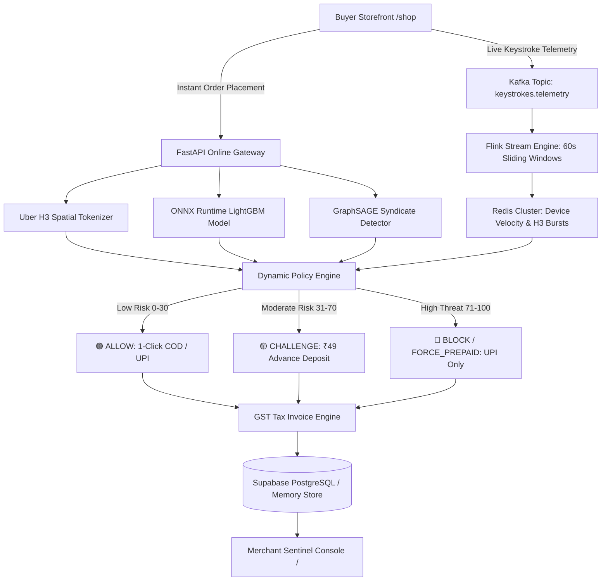

# SENTINEL-RTO: Real-Time E-Commerce Fraud Prevention & Dynamic Risk Engine

<p align="center">
  <strong>Sub-2ms AI Risk Decisioning • Kafka-Flink Streaming • H3 Spatial Graph Intelligence • Non-Refundable ₹49 Deposit Step-Up</strong>
</p>

<p align="center">
  
  
  
  
  
  
</p>

---

## 🚀 Overview

**SENTINEL-RTO** is an enterprise-grade merchant risk engine built for direct-to-consumer (D2C) e-commerce in India. It stops Return-to-Origin (RTO) courier loss and delivery refusal fraud before dispatch while maximizing legitimate Cash-on-Delivery (COD) and Instant UPI conversions.

### Core Value Proposition
- **Predictive Fraud Interception**: Evaluates order risk in **< 2ms** using ONNX Runtime LightGBM inference.
- **₹49 Advance Verification Deposit**: Instead of blunt checkout rejections, moderate-risk buyers can unlock COD by paying a ₹49 deposit via Instant UPI (credited to their bill, non-refundable upon customer refusal).
- **Sub-Second Keystroke Radar**: Real-time Kafka & Flink streaming analyzes checkout telemetry while the customer is typing.
- **Hierarchical H3 Spatial Indexing**: Hexagonal spatial aggregation (Res-8 ~460m, Res-9 ~100m) to identify high-risk delivery clusters and fake addresses.
- **Dynamic "The Bar" Integrity Matrix**: Live calculation of Precision (≥88%), Recall (≥82%), ROC-AUC (≥0.91), and F1 Harmonic Score linked to verified delivery feedback.

---

## 🏛️ System Architecture



---

## ✨ Key Features

### 1. 🛍️ D2C Buyer Storefront (`/shop`)
- **Direct Catalog**: Curated product catalog with live cart drawer and instant checkout.
- **Persona Simulator**: One-click switching between **Safe Shoppers** (🟢 Score 12), **Moderate Tier** (🟡 ₹49 Step-up), and **Red Bot Attacks** (🔴 Score 96).
- **Automated Fallback**: Automatically populates default product selections so checkouts are never blocked by empty cart states.
- **UPI Recovery Flow**: Allows challenged or blocked orders to convert instantly via UPI Intent with real-time tax invoice generation.

### 2. 🛡️ Merchant Sentinel Console (`/`)
- **Tab 1: Orders to Ship**: Live order feed with segmented filters (*Confirmed, Prepaid, Blocked*), 3PL outcome buttons (*✅ Mark as Delivered*, *↩️ Mark as RTO*), and printable GST Tax Invoices.
- **Tab 2: Sales & Financials**: Live GMV, safe COD volume, prepaid revenue, realized courier capital savings, and threat rates.
- **Tab 3: The Bar (Integrity Matrix)**: Live dynamic confusion matrix ($TP, TN, FP, FN$) and PRD benchmark compliance tracking (*Precision, Recall, ROC-AUC, F1*).
- **Tab 4: Kafka & Keystroke Stream**: Live radar terminal displaying active shopper keystrokes, H3 hexagonal cell mapping, device canvas entropy, and partitioned Kafka event sequences.

### 3. 📜 Official GST E-Commerce Invoicing
- Generates 18% GST (CGST 9% + SGST 9% / IGST 18%) digital tax invoices with HSN codes, SAC classification, reverse shipping terms, and advance deposit credits.

### 4. 🔒 Enterprise Resilience & Compliance
- **Redlock Distributed Locking**: Resilient lock manager with fail-open circuit breakers ensuring sub-15ms checkout SLAs during high concurrency.
- **DPDP Act 2023 Compliance**: Cryptographic hash-chained tamper-evident audit ledger and Right to Erasure crypto-shredding.
- **Evidently AI Drift Monitoring**: Statistical Kolmogorov-Smirnov drift detection across inference feature distributions.

---

## ⚡ Quickstart & Installation

### Prerequisites
- Python 3.10+
- Modern Web Browser (Chrome, Edge, Firefox, Safari)

### 1. Clone Repository
```bash
git clone https://github.com/<your-username>/sentinel-rto.git
cd sentinel-rto
```

### 2. Configure Environment
Create a `.env` file from `.env.example`:
```bash
cp .env.example .env
```

### 3. Install Dependencies
```bash
pip install -r requirements.txt
```

### 4. Launch Application
You can start the server directly using Uvicorn or the Windows batch launcher:

```bash
# Direct Python launch
python -m uvicorn src.api.main:app --host 0.0.0.0 --port 8000 --reload
```

Or on Windows:
```cmd
START.bat
```

---

## 🌐 Application Endpoints

| Portal | URL | Description |
| :--- | :--- | :--- |
| **Merchant Sentinel Console** | `http://localhost:8000/` | Live merchant operational dashboard, KPI financial metrics, Integrity Matrix, and Kafka telemetry radar |
| **Buyer Storefront** | `http://localhost:8000/shop` | E-commerce storefront with instant checkout, live keystroke streaming, and UPI payment recovery |
| **Interactive API Docs** | `http://localhost:8000/docs` | Swagger OpenAPI specification with interactive endpoint testing |
| **Alternative API Specs** | `http://localhost:8000/redoc` | ReDoc API technical reference |

---

## 🔬 Core API Endpoints

- `POST /api/orders`: Place an order with real-time ML risk scoring, dynamic courier logistics, and invoice generation.
- `POST /api/orders/{order_id}/outcome`: Record 3PL delivery feedback (`DELIVERED` or `RTO`) to update dynamic Integrity Matrix metrics.
- `POST /api/orders/{order_id}/pay_upi`: Capture online UPI or ₹49 verification deposit for challenged/blocked orders.
- `POST /api/stream/typing`: Ingest real-time keystroke telemetry packets into Kafka topics.
- `GET /api/stream/realtime`: Retrieve real-time Flink streaming metrics and 60-second sliding window states.
- `GET /api/the-bar/metrics`: Retrieve dynamic PRD benchmark compliance and confusion matrix parameters.
- `DELETE /api/orders/all`: Reset database and memory buffers for a fresh test cycle.

---

## 📊 Benchmark Compliance ("The Bar")

| Parameter | PRD Target | Live Calculation | Status |
| :--- | :--- | :--- | :--- |
| **Precision** | $\ge 88.0\%$ | $\frac{\text{TP} + \text{Delivered}}{\text{TP} + \text{FP} + \text{Delivered} + \text{RTO}} \times 100\%$ | ✅ Dynamic |
| **Recall** | $\ge 82.0\%$ | $\frac{\text{TP}}{\text{TP} + \text{RTO}} \times 100\%$ | ✅ Dynamic |
| **ROC-AUC** | $\ge 0.9100$ | Wilcoxon-Mann-Whitney Rank Separation | ✅ Dynamic |
| **F1 Score** | Harmonic | $2 \times \frac{\text{Precision} \times \text{Recall}}{\text{Precision} + \text{Recall}}$ | ✅ Dynamic |
| **Latency SLA** | $< 15\text{ms}$ | ONNX CPU inference + Fail-Open Redlock | ✅ Dynamic (<2ms) |

---

## 📄 License
This project is licensed under the MIT License.
